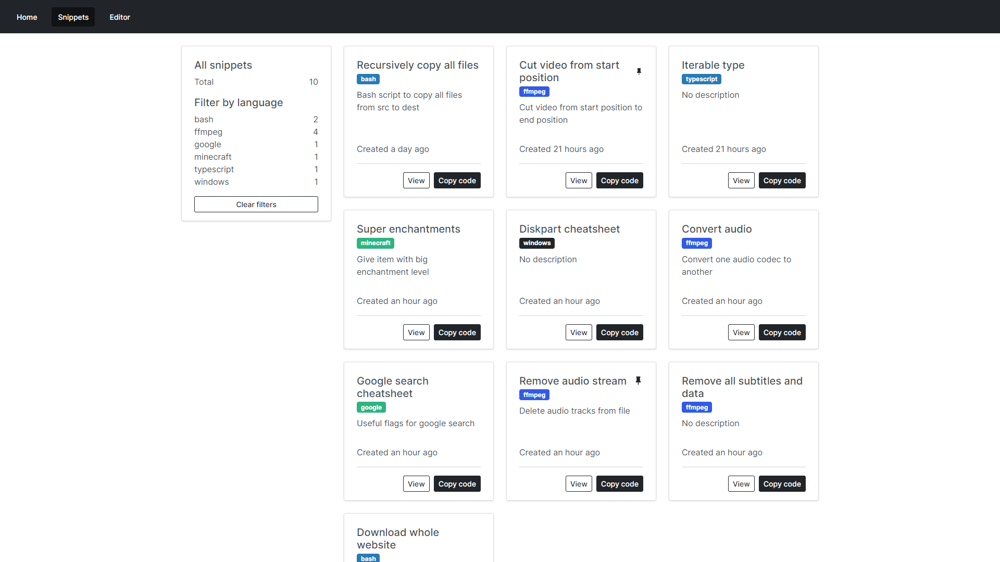
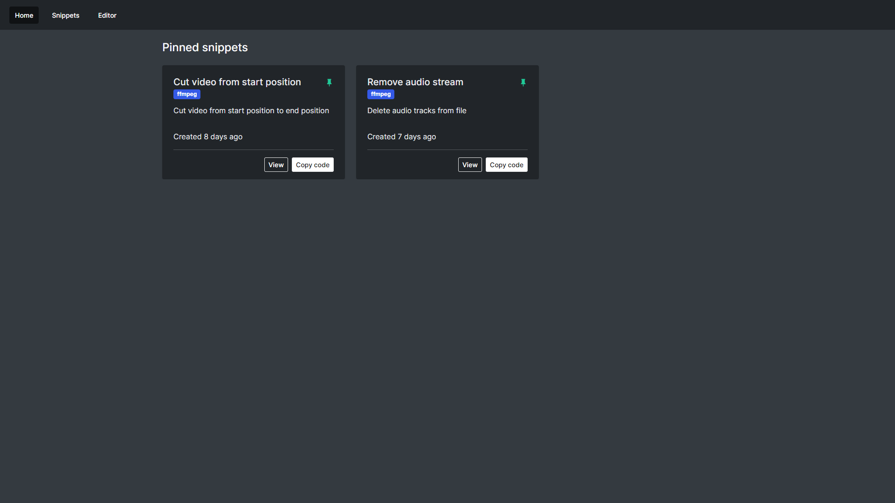
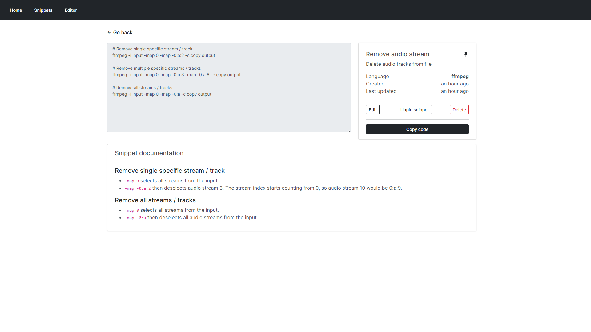
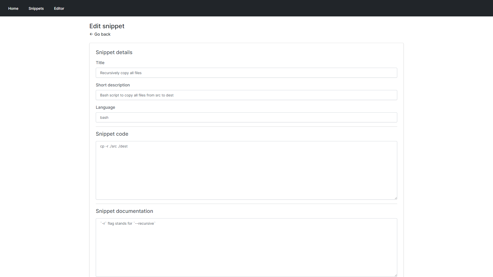

# Snippet Box



## Description

Snippet Box is a simple self-hosted app for organizing your code snippets. It allows you to easily create, edit, browse and manage your snippets in various languages. With built-in Markdown support, Snippet Box makes it very easy to add notes or simple documentation to your code.

## Technology

- Backend
  - Node.js
  - Express.js
  - Sequelize ORM + SQLite
- Frontend
  - React
  - TypeScript
  - Bootstrap
- Deployment
  - Docker

## Development

```sh
# clone repository
git clone https://github.com/pawelmalak/snippet-box
cd snippet-box

# install dependencies (run only once)
npm run init

# start backend and frontend development servers
npm run dev
```

## Installation

### With Docker

#### Building image

```sh
docker build -t snippet-box .
```

#### Deployment

```sh
# run container
docker run -p 5000:5000 -v /path/to/data:/app/data snippet-box
```

## Functionality

- Pinned snippets
  - Pin your favorite / important snippets to home screen for easy and quick access



- Snippet library
  - Manage your snippets through snippet library
  - Easily filter and access your code


- Snippet
  - View your code, snippet details and documentation
  - Easily perform snippet actions like edit, pin or delete from a single place



- Edditor
  - Create and edit your snippets from simple and easy to use editor


